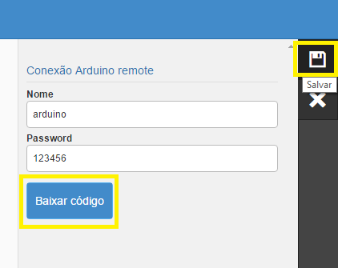

##Tutorial Arduino Cloud Link

As instruções a seguir tem o intuito de auxiliar a configuração do Arduino com o servidor Elipse, tendo em vista a facilidade de conexão e a utilização do conceito da Internet das Coisas. Como pré-requisito é necessário ter um Shield Ethernet (mais informações a respeito acesse o link: [Tutorial](http://blog.filipeflop.com/arduino/tutorial-ethernet-shield-w5100.html)) para conectar o Arduino na Internet. Na execução deste exemplo, foram utilizados uma placa RLRobotics v1.0 (similar ao Arduino Uno) e um Shield Ethernet Arduino.

Após baixar o código, siga os passos a seguir: 

1. Entre no site http://www.elipsemobile.com/ e crie sua conta clicando em "Teste Grátis".
  

2. Ao preencher os campos, preste atenção no nome do aplicativo, pois será através dele que sua 
aplicação criará a URL. O usuário e senha serão utilizados para acessar sua aplicação posteriormente. 
Clique em "Criar conta".
  

3. Você receberá um e-mail que solicitará a confirmação de sua conta. Ao acessar o link, aparecerá uma mensagem de agradecimento e a opção para ir ao painel administrativo, conforme a imagem abaixo:
  

4. Ao entrar no painel administrativo, irão aparecer suas aplicações, no caso do exemplo irá aparecer "exemplocloudlink" e a URL da mesma, conforme a imagem a seguir:
  

5. Clique na url para acessar a aplicação criada. Serão solicitados Usuário e Senha, cadastrados anteriormente.
  

6. clique em entrar e aparecerá a tela inicial de sua aplicação, conforme a imagem abaixo:
  

7. Agora podemos configurar uma nova conexão com o Arduino, para isso precisamos clicar em "Menu principal" (canto superior esquerdo)e depois em "Conexões" conforme figura a seguir:
  

8. Após, aparecerá a tela com as conexões existentes. Por padrão, aparecerá a conexão "demo", mas 
não iremos usá-la, pois vamos criar uma nova. No canto superior direito clique no sinal de "+" e
escolha "Arduino Remote" como mostram as imagens:
   
   

9. Em seguida, aparecerão os campos para inserir o nome da conexão e uma senha. Tais informações 
serão utilizadas no código que poderá ser baixado por meio do botão "Baixar código". 
Faça o download do código como solicitado e clique em "Salvar", conforme a imagem a seguir:
   

