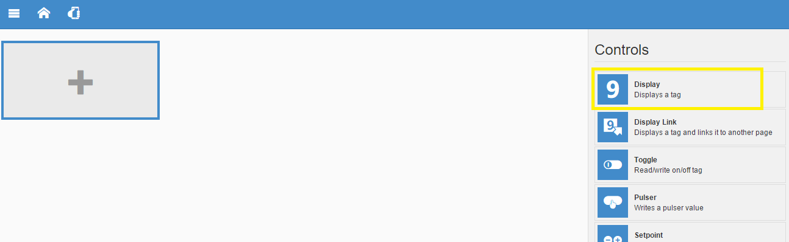

##Tutorial Arduino Cloud Link

As instruções a seguir tem o intuito de auxiliar a configuração do Arduino com o servidor Elipse, tendo em vista a facilidade de conexão e a utilização do conceito de Internet das Coisas. Para conectar o Arduino na Internet é necessário ter um [Shield Ethernet](https://www.arduino.cc/en/Main/ArduinoEthernetShield), mais informações a respeito acesse o link: [tutorial ethernet shield](http://blog.filipeflop.com/arduino/tutorial-ethernet-shield-w5100.html). Na execução deste exemplo, foram utilizados uma placa RLRobotics v1.0 (similar ao Arduino Uno) e um Shield Ethernet Arduino.

1. Entre no site http://www.elipsemobile.com/ e crie sua conta clicando em "Teste Grátis".
   

2. Ao preencher os campos, preste atenção no nome do aplicativo, pois será através dele que sua 
aplicação criará a URL. O usuário e senha serão utilizados para acessar sua aplicação posteriormente. 
Clique em "Criar conta".
   

3. Você receberá um e-mail que solicitará a confirmação de sua conta. Ao acessar o link, aparecerá uma mensagem de agradecimento e a opção para ir ao painel administrativo, conforme a imagem abaixo:
   

4. Ao entrar no painel administrativo, irão aparecer suas aplicações, no caso do exemplo irá aparecer "exemplocloudlink" e a URL da mesma, conforme a imagem a seguir:
   

5. Clique na url para acessar a aplicação criada. Serão solicitados Usuário e Senha, cadastrados anteriormente.
  

6. clique em entrar e aparecerá a tela inicial de sua aplicação, conforme a imagem abaixo:
   

7. Agora é possível configurar uma nova conexão com o Arduino, para isso é necessário clicar em "Menu principal" (canto superior esquerdo)e depois em "Conexões" conforme figura a seguir:
   

8. Após, aparecerá a tela com as conexões existentes. Por padrão, aparecerá a conexão "demo", mas 
não será utilizada, pois será criada uma nova. No canto superior direito clique no sinal de "+" e
escolha "Arduino Remote" como mostram as imagens:
   
   

9. Em seguida, aparecerão os campos para inserir o nome da conexão e uma senha. Tais informações 
serão utilizadas no código arduino, que poderá ser baixado por meio do botão "Baixar código". 
Faça o download como solicitado e clique em "Salvar", conforme a imagem a seguir:
   

10. Para adicionar a biblioteca ArduinoCloudLink é necessário abrir a IDE do Arduino
e clicar em "Sketch-> Include Library -> Add .ZIP Library...". Localize a pasta recentemente
baixada "ArduinoCloudLink.zip" e clique em "Open".
   

11. Para demonstrar a utilização da biblioteca será necessário abrir o código de exemplo, o caminho do mesmo se encontra em "File->Examples->ArduinoCloudLink->Examples->Example1"
   

12. O código apresentado irá fazer a conexão entre o Arduino e a aplicação criada. Localize o comentário "Configuration" e faça a substituição conforme imagem abaixo: 
    

    Após, faça o upload e pronto! Seu arduino está conectado com sua aplicação.

13. Agora vamos colocar os dados de alguma porta analógica do Arduino na aplicação:
    - Vá para página inicial (símbolo da casinha); 
    - No canto superior direito clique no símbolo do lápis (editar); 
    - Selecione e exclua os grupos de exemplos por meio do símbolo excuir:
    

14. Clique no símbolo "+" em cinza dentro do retângulo e escolha algum controle, no exemplo 
será usado um Display que irá coletar os dados da porta analógica A2 do Arduino:
    

15. Para selecionar uma Tag, que no caso será um pino analógico, vá na opção "Tag", conforme a figura:
    

16. Depois será possível optar por alguma conexão, no caso do exemplo foi criada a "arduino", clique
no diretório correspondente e escolha a tag desejada:

    
     

17. Personalize os campos como desejar e clique em "Salvar":
    

18. Depois de salvo é necessário clicar em "Run", conforme a imagem:
    

